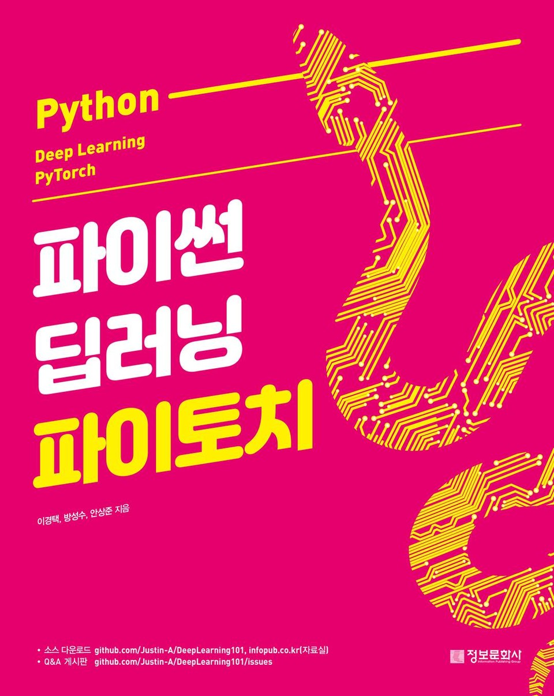

# 파이썬 딥러닝 파이토치

## 소개

> 세부 내용 : [리디북스 <파이썬 딥러닝 파이토치>](https://ridibooks.com/books/1170000121?_s=search&_q=%ED%8C%8C%EC%9D%B4%EC%8D%AC+%EB%94%A5%EB%9F%AC%EB%8B%9D+%ED%8C%8C%EC%9D%B4%ED%86%A0%EC%B9%98&_rdt_sid=search&_rdt_idx=0)

## 목차

**Part 01 파이토치 기초**
1. 파이썬 또는 아나콘다 설치하기
2. CUDA, CuDNN 설치하기
3. 파이토치 설치하기
4. 반드시 알아야 하는 파이토치 스킬

**Part 02 AI Background**
1. 인공지능(딥러닝)의 정의와 사례
2. 파이토치
3. 머신러닝의 정의와 종류
4. 과적합
5. 인공 신경망
6. 성능 지표

**Part 03 Deep Learning**
1. 딥러닝의 정의
2. 딥러닝이 발전하게 된 계기
3. 딥러닝의 종류
4. 딥러닝의 발전을 이끈 알고리즘

**Part 04 컴퓨터 비전**
1. Convolutional Neural Network(CNN)
2. CNN과 MLP
3. Data Augmentation
4. CNN Architecture
5. Transfer Learning

**Part 05 자연어 처리**
1. Data & Task: 어떤 데이터가 있을까?
2. 문자를 숫자로 표현하는 방법
3. Models
4. Recap

**Part 06 Other Topics**
1. Generative Adversarial Networks(GAN)
2. 강화학습
3. Domain Adaptation
4. Continual Learning
5. Object Detection
6. Segmentation
7. Meta Learning
8. AutoML